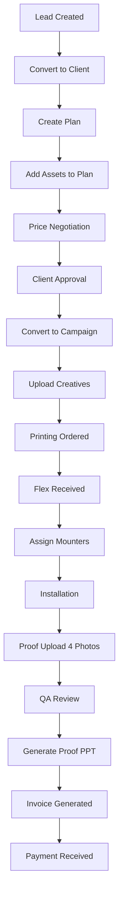

# GO-ADS 360° — Complete System Audit & Enterprise Roadmap

**Generated:** 2026-01-30  
**Version:** 3.0  
**Status:** PRODUCTION AUDIT

---

## TABLE OF CONTENTS

1. [Executive Summary](#1-executive-summary)
2. [Complete Routes Audit](#2-complete-routes-audit)
3. [Unused & Junk Page Analysis](#3-unused--junk-page-analysis)
4. [Future Enterprise Placeholder Routes](#4-future-enterprise-placeholder-routes)
5. [Database Tables & Schema Inventory](#5-database-tables--schema-inventory)
6. [Asset Code Standard](#6-asset-code-standard)
7. [Campaign & Operations Workflow](#7-campaign--operations-workflow)
8. [Report Rules (Canonical)](#8-report-rules-canonical)
9. [Gap Analysis & Risk Register](#9-gap-analysis--risk-register)
10. [Actionable Roadmap](#10-actionable-roadmap)

---

## 1. EXECUTIVE SUMMARY

GO-ADS 360° is a multi-tenant SaaS platform for Out-of-Home (OOH) media management. The platform digitizes the entire advertising lifecycle:

**Lead → Client → Plan → Campaign → Operations → Finance → Reports**

### Current State Assessment

| Metric | Count | Status |
|--------|-------|--------|
| Total Routes | 135+ | Mixed |
| Active Routes | 95 | Functional |
| Blank/Placeholder | 12 | Needs Work |
| Duplicate/Redirect | 15 | Cleanup Needed |
| Future Reserved | 25+ | Not Implemented |

### Key Findings

1. **Routes:** Many duplicate routes exist (e.g., `/finance/expenses` and `/admin/expenses` point to same component)
2. **Finance Module:** Recently upgraded with enterprise expenses - needs completion
3. **Asset Codes:** Mixed usage of UUIDs and human-readable codes throughout
4. **Reports V2:** Framework exists but inconsistent adoption across modules

---

## 2. COMPLETE ROUTES AUDIT

### 2.1 ACTIVE ROUTES (Currently Used)

| Route | Page Title | Module | Status | Auth | Role | Notes |
|-------|-----------|--------|--------|------|------|-------|
| `/` | Landing | Public | Active | No | All | Marketing landing page |
| `/auth` | Login/Register | Auth | Active | No | All | Authentication flow |
| `/register-company` | Company Registration | Auth | Active | No | All | New tenant onboarding |
| `/onboarding` | Company Onboarding | Auth | Active | Yes | All | Post-registration setup |
| `/install` | PWA Install | Public | Active | No | All | PWA installation prompt |
| `/explore` | Marketplace | Public | Active | No | All | Public asset marketplace |
| `/marketplace` | Marketplace | Public | Active | No | All | Duplicate of /explore |
| `/marketplace/asset/:id` | Asset Detail | Public | Active | No | All | Public asset view |
| `/campaign-track/:token` | Campaign Tracking | Public | Active | No | All | Client tracking link |
| `/mounter/tasks` | Mounter Tasks | Operations | Active | Yes | Mounter | Field team task view |
| `/mobile/*` | Mobile App | Operations | Active | Yes | Field | Mobile-optimized views |
| `/admin/dashboard` | Dashboard | Core | Active | Yes | All | Main dashboard |
| `/admin/companies` | Companies | Admin | Active | Yes | Admin | Company management |
| `/admin/clients` | Clients List | Clients | Active | Yes | Sales/Admin | Client management |
| `/admin/clients/new` | New Client | Clients | Active | Yes | Sales/Admin | Create client |
| `/admin/clients/:id` | Client Detail | Clients | Active | Yes | Sales/Admin | View client |
| `/admin/clients/edit/:id` | Edit Client | Clients | Active | Yes | Sales/Admin | Edit client |
| `/admin/clients/:id/analytics` | Client Analytics | Reports | Active | Yes | Sales/Admin | Client analytics |
| `/admin/clients/import` | Import Clients | Clients | Active | Yes | Admin | Bulk import |
| `/admin/leads` | Leads List | Leads | Active | Yes | Sales | Lead management |
| `/admin/leads/new` | New Lead | Leads | Active | Yes | Sales | Create lead |
| `/admin/leads/:id` | Lead Detail | Leads | Active | Yes | Sales | View lead |
| `/admin/media-assets` | Assets List | Assets | Active | Yes | All | Media inventory |
| `/admin/media-assets/new` | New Asset | Assets | Active | Yes | Admin | Create asset |
| `/admin/media-assets/:code` | Asset Detail | Assets | Active | Yes | All | View asset |
| `/admin/media-assets/edit/:code` | Edit Asset | Assets | Active | Yes | Admin | Edit asset |
| `/admin/media-assets/import` | Import Assets | Assets | Active | Yes | Admin | Bulk import |
| `/admin/media-assets/validate` | Validate Assets | Assets | Active | Yes | Admin | Data validation |
| `/admin/media-assets/duplicates` | Find Duplicates | Assets | Active | Yes | Admin | Duplicate detection |
| `/admin/media-assets-map` | Map View | Assets | Active | Yes | All | Geographic view |
| `/admin/media-assets-health` | Health Report | Assets | Active | Yes | Admin | Data quality |
| `/admin/plans` | Plans List | Plans | Active | Yes | Sales | Media plans |
| `/admin/plans/new` | New Plan | Plans | Active | Yes | Sales | Create plan |
| `/admin/plans/:id` | Plan Detail | Plans | Active | Yes | Sales | View plan |
| `/admin/plans/edit/:id` | Edit Plan | Plans | Active | Yes | Sales | Edit plan |
| `/admin/plans/:id/share/:shareToken` | Plan Share | Plans | Active | No | All | Public plan sharing |
| `/admin/plans-compare` | Plan Comparison | Plans | Active | Yes | Sales | Compare plans |
| `/admin/campaigns` | Campaigns List | Campaigns | Active | Yes | All | Campaign management |
| `/admin/campaigns/create` | Create Campaign | Campaigns | Active | Yes | Sales | New campaign |
| `/admin/campaigns/:id` | Campaign Detail | Campaigns | Active | Yes | All | View campaign |
| `/admin/campaigns/edit/:id` | Edit Campaign | Campaigns | Active | Yes | Sales | Edit campaign |
| `/admin/campaigns/:id/budget` | Campaign Budget | Campaigns | Active | Yes | Finance | Budget tracking |
| `/admin/operations` | Operations Dashboard | Operations | Active | Yes | Ops | Operations hub |
| `/admin/operations/:id` | Operation Detail | Operations | Active | Yes | Ops | Campaign operations |
| `/admin/operations/:campaignId/assets/:assetId` | Asset Proofs | Operations | Active | Yes | Ops | Proof upload |
| `/admin/operations/creatives` | Creatives | Operations | Active | Yes | Ops | Creative management |
| `/admin/operations/printing` | Printing | Operations | Active | Yes | Ops | Print tracking |
| `/admin/operations/proof-uploads` | Proof Uploads | Operations | Active | Yes | Ops | Proof management |
| `/admin/operations-analytics` | Ops Analytics | Reports | Active | Yes | Ops | Operations reports |
| `/admin/operations-calendar` | Ops Calendar | Operations | Active | Yes | Ops | Calendar view |
| `/admin/invoices` | Invoices List | Finance | Active | Yes | Finance | Invoice management |
| `/admin/invoices/new` | Create Invoice | Finance | Active | Yes | Finance | New invoice |
| `/admin/invoices/:id` | Invoice Detail | Finance | Active | Yes | Finance | View invoice |
| `/admin/expenses` | Expenses | Finance | Active | Yes | Finance | Expense tracking |
| `/admin/vendors` | Vendors | Finance | Active | Yes | Finance | Vendor management |
| `/admin/payments` | Payments | Finance | Active | Yes | Finance | Payment tracking |
| `/admin/power-bills` | Power Bills | Finance | Active | Yes | Finance | Electricity bills |
| `/admin/power-bills-analytics` | Bills Analytics | Reports | Active | Yes | Finance | Bill analysis |
| `/admin/power-bills-bulk-payment` | Bulk Payment | Finance | Active | Yes | Finance | Batch payments |
| `/admin/power-bills/bulk-upload` | Bill Upload | Finance | Active | Yes | Finance | Import bills |
| `/admin/power-bills/reconciliation` | Reconciliation | Finance | Active | Yes | Finance | Bank reconciliation |
| `/admin/power-bills/scheduler` | Bill Scheduler | Finance | Active | Yes | Finance | Payment reminders |
| `/admin/power-bills-sharing` | Bill Sharing | Finance | Active | Yes | Finance | Share bills |
| `/admin/reports/clients` | Client Report | Reports | Active | Yes | All | Client bookings |
| `/admin/reports/campaigns` | Campaign Report | Reports | Active | Yes | All | Campaign bookings |
| `/admin/reports/revenue` | Revenue Report | Reports | Active | Yes | Finance | Asset revenue |
| `/admin/reports/financial` | Financial Summary | Reports | Active | Yes | Finance | Finance overview |
| `/admin/reports/proof-execution` | Proof Report | Reports | Active | Yes | Ops | Execution tracking |
| `/admin/reports/vacant-media` | Vacant Media | Reports | Active | Yes | Sales | Availability |
| `/admin/approvals` | Approvals Queue | Approvals | Active | Yes | Approver | Pending approvals |
| `/admin/approval-history` | Approval History | Approvals | Active | Yes | All | Audit trail |
| `/admin/approvals/rules` | Approval Rules | Approvals | Active | Yes | Admin | Configure rules |
| `/admin/approval-settings` | Approval Settings | Approvals | Active | Yes | Admin | Settings |
| `/admin/approval-delegation` | Delegation | Approvals | Active | Yes | Manager | Delegate approvals |
| `/admin/approval-analytics` | Approval Analytics | Reports | Active | Yes | Admin | Approval metrics |
| `/admin/ai-assistant` | AI Assistant | AI | Active | Yes | All | Natural language queries |
| `/admin/gallery` | Photo Gallery | Operations | Active | Yes | All | Media library |
| `/admin/photo-library` | Photo Library | Operations | Active | Yes | All | Duplicate of gallery |
| `/admin/audit-logs` | Audit Logs | Admin | Active | Yes | Admin | Activity tracking |
| `/admin/users` | User Management | Admin | Active | Yes | Admin | User administration |
| `/admin/company-settings/*` | Company Settings | Settings | Active | Yes | Admin | 15+ sub-routes |
| `/settings/profile` | Profile Settings | Settings | Active | Yes | All | User profile |
| `/settings/theme` | Theme Settings | Settings | Active | Yes | All | UI customization |
| `/settings/notifications` | Notifications | Settings | Active | Yes | All | Alert preferences |
| `/admin/platform` | Platform Admin | Platform | Active | Yes | Platform | Super admin |
| `/admin/platform/users` | Manage Users | Platform | Active | Yes | Platform | All users |
| `/admin/platform/companies` | Manage Companies | Platform | Active | Yes | Platform | All companies |
| `/admin/subscriptions` | Subscriptions | Platform | Active | Yes | Platform | Billing |
| `/admin/platform-reports` | Platform Reports | Platform | Active | Yes | Platform | Platform analytics |
| `/portal/dashboard` | Client Portal | Portal | Active | Yes | Client | Client dashboard |
| `/portal/proofs` | Client Proofs | Portal | Active | Yes | Client | View proofs |
| `/portal/payments` | Client Payments | Portal | Active | Yes | Client | Payment history |
| `/portal/downloads` | Client Downloads | Portal | Active | Yes | Client | Download center |
| `/portal/invoices` | Client Invoices | Portal | Active | Yes | Client | View invoices |
| `/portal/campaigns/:id` | Client Campaign | Portal | Active | Yes | Client | Campaign view |

### 2.2 REDIRECT ROUTES (Cleanup Candidates)

| Route | Redirects To | Notes |
|-------|-------------|-------|
| `/admin` | `/admin/dashboard` | Standard redirect |
| `/media-assets` | `/admin/media-assets` | Legacy path support |
| `/media-assets/new` | `/admin/media-assets/new` | Legacy path support |
| `/media-assets/:code` | `/admin/media-assets/:code` | Legacy path support |
| `/clients` | `/admin/clients` | Legacy path support |
| `/plans` | `/admin/plans` | Legacy path support |
| `/campaigns` | `/admin/campaigns` | Legacy path support |
| `/admin/settings` | `/admin/company-settings` | Renamed route |
| `/finance/invoices` | `/admin/invoices` | Consolidation redirect |
| `/finance/invoices/new` | `/admin/invoices/new` | Consolidation redirect |
| `/dashboard` | Uses DashboardRouter | Duplicate of /admin/dashboard |

### 2.3 DUPLICATE ROUTES (Same Component, Different Path)

| Route 1 | Route 2 | Component | Action |
|---------|---------|-----------|--------|
| `/explore` | `/marketplace` | Marketplace | Keep one, redirect other |
| `/admin/ai-assistant` | `/admin/assistant` | AIAssistant | Keep one, redirect other |
| `/admin/gallery` | `/admin/photo-library` | PhotoGallery | Keep one, redirect other |
| `/admin/expenses` | `/finance/expenses` | ExpensesList | Keep one, redirect other |
| `/reports/vacant-media` | `/admin/reports/vacant-media` | MediaAvailabilityReport | Keep one |
| `/admin/media-assets-validation` | `/admin/media-assets/validate` | MediaAssetsValidation | Keep one |

### 2.4 BLANK / INCOMPLETE ROUTES

| Route | Status | Issue | Recommendation |
|-------|--------|-------|----------------|
| `/admin/sales-orders` | Partial | Shows estimations, not real sales orders | Rename or implement properly |
| `/admin/purchase-orders` | Partial | Shows expenses, not real POs | Rename or implement properly |
| `/admin/proformas` | Active | Basic list, no create/edit | Complete CRUD |
| `/admin/estimations` | Active | Basic list, no create/edit | Complete CRUD |
| `/admin/invoices-import` | Placeholder | Basic import UI | Needs validation logic |
| `/admin/workflow-test` | Dev Only | Testing page | Remove from production |
| `/admin/onboarding` | Dev Only | Test page | Remove or hide |
| `/admin/company-testing` | Dev Only | Test page | Remove from production |
| `/admin/ui-showcase` | Dev Only | Component showcase | Remove from production |
| `/admin/dashboard-builder` | Placeholder | Custom dashboard builder | Future enterprise |
| `/admin/custom-dashboard` | Placeholder | User dashboards | Future enterprise |

### 2.5 BROKEN / MISROUTED PAGES

| Route | Issue | Fix Required |
|-------|-------|--------------|
| `/admin/operations/:campaignId/assets` | Redirects incorrectly sometimes | Check CampaignAssetsRedirect logic |
| `/finance/estimations/new` | Referenced in code but route doesn't exist | Add route or fix navigation |
| `/finance/estimations/:id` | Referenced in code but route doesn't exist | Add route or fix navigation |

---

## 3. UNUSED & JUNK PAGE ANALYSIS

### 3.1 Safe to Delete

| File | Route | Reason | Risk |
|------|-------|--------|------|
| `WorkflowTest.tsx` | `/admin/workflow-test` | Development testing only | Low |
| `OnboardingTest.tsx` | `/admin/onboarding` | Development testing only | Low |
| `CompanyTesting.tsx` | `/admin/company-testing` | Development testing only | Low |
| `ComponentShowcase.tsx` | `/admin/ui-showcase` | Development showcase | Low |

### 3.2 Archive / Convert to Enterprise

| File | Current Purpose | Recommendation |
|------|----------------|----------------|
| `DashboardBuilder.tsx` | Custom dashboards (incomplete) | Keep for Enterprise tier |
| `CustomDashboard.tsx` | User dashboards (incomplete) | Keep for Enterprise tier |
| `PlanTemplateForm.tsx` | Plan templates (not linked) | Keep, add to navigation |
| `PlanTemplatesList.tsx` | Plan templates (not linked) | Keep, add to navigation |
| `PlanTemplatePreview.tsx` | Plan templates (not linked) | Keep, add to navigation |

### 3.3 Consolidate / Merge

| Files to Merge | Reason |
|----------------|--------|
| `ExpensesList.tsx` (components/finance) + Enterprise hooks | Old basic expenses vs new enterprise |
| `SalesOrders.tsx` + `EstimationsList.tsx` | Same purpose, different names |
| `PurchaseOrders.tsx` + Expenses | PO is showing expenses data |

---

## 4. FUTURE ENTERPRISE PLACEHOLDER ROUTES

### 4.1 Finance (Enterprise)

| Route | Purpose | Dependencies | Priority | Readiness |
|-------|---------|--------------|----------|-----------|
| `/admin/finance/dashboard` | Unified finance hub | All finance tables | P1 | Partial (FinanceDashboard exists) |
| `/admin/finance/budgets` | Budget planning & tracking | expense_budgets table | P1 | Ready (table exists) |
| `/admin/finance/vendor-ledger` | Vendor-wise ledger | vendors, expenses | P2 | Partial |
| `/admin/finance/tax-reports` | GST/TDS reports | invoices, expenses | P2 | Blocked |
| `/admin/finance/bank-reconciliation` | Bank statement matching | expenses, payments | P3 | Blocked |
| `/admin/finance/credit-notes` | Credit note management | invoices | P3 | Blocked |
| `/admin/finance/debit-notes` | Debit note management | expenses | P3 | Blocked |

### 4.2 Operations (Enterprise)

| Route | Purpose | Dependencies | Priority | Readiness |
|-------|---------|--------------|----------|-----------|
| `/admin/operations/sla-tracking` | SLA monitoring | campaign_assets, SLA config | P1 | Blocked |
| `/admin/operations/mounter-performance` | Field team metrics | campaign_assets, mounters | P2 | Partial |
| `/admin/operations/auto-assign` | Intelligent task assignment | mounters, campaign_assets | P2 | Blocked |
| `/admin/operations/quality-audit` | QA workflow | campaign_assets, proofs | P2 | Blocked |
| `/admin/operations/fleet-tracking` | Vehicle GPS tracking | New tables needed | P3 | Blocked |

### 4.3 Reports (Advanced)

| Route | Purpose | Dependencies | Priority | Readiness |
|-------|---------|--------------|----------|-----------|
| `/admin/reports/forecast` | Revenue forecasting | campaigns, invoices | P1 | Partial (RevenueForecast exists) |
| `/admin/reports/occupancy` | Asset occupancy rates | media_assets, campaigns | P1 | Blocked |
| `/admin/reports/profitability` | Asset/Campaign P&L | All finance tables | P2 | Blocked |
| `/admin/reports/comparison` | Period comparison | All tables | P2 | Blocked |
| `/admin/reports/aging` | Receivables aging | invoices | P2 | Blocked |
| `/admin/reports/executive` | Executive dashboard | All tables | P3 | Blocked |

### 4.4 Admin / Governance

| Route | Purpose | Dependencies | Priority | Readiness |
|-------|---------|--------------|----------|-----------|
| `/admin/data-health` | Data quality dashboard | All tables | P1 | Partial |
| `/admin/system-settings` | Global configuration | settings tables | P2 | Partial |
| `/admin/feature-flags` | Feature toggles | New table needed | P2 | Blocked |
| `/admin/backup-restore` | Data backup UI | Supabase functions | P3 | Blocked |
| `/admin/api-keys` | API key management | New table needed | P3 | Blocked |

---

## 5. DATABASE TABLES & SCHEMA INVENTORY

### 5.1 Core Business Tables

| Table | Purpose | Primary Key | Foreign Keys | Status |
|-------|---------|-------------|--------------|--------|
| `companies` | Multi-tenant orgs | id (UUID) | created_by → profiles | Active |
| `company_users` | User-company mapping | id (UUID) | company_id, user_id | Active |
| `profiles` | User profiles | id (UUID) | → auth.users | Active |
| `clients` | Customer database | id (TEXT) | company_id | Active |
| `client_contacts` | Client contacts | id (UUID) | client_id | Active |
| `leads` | Sales leads | id (UUID) | company_id | Active |
| `media_assets` | OOH inventory | id (TEXT) | company_id | Active |
| `plans` | Media plans | id (TEXT) | company_id, client_id | Active |
| `plan_items` | Plan line items | id (UUID) | plan_id, asset_id | Active |
| `campaigns` | Active campaigns | id (TEXT) | company_id, plan_id, client_id | Active |
| `campaign_assets` | Campaign inventory | id (UUID) | campaign_id, asset_id | Active |
| `campaign_items` | Campaign line items | id (UUID) | campaign_id, asset_id | Active |
| `campaign_creatives` | Creative files | id (UUID) | campaign_id | Active |

### 5.2 Operations Tables

| Table | Purpose | Primary Key | Foreign Keys | Status |
|-------|---------|-------------|--------------|--------|
| `mounters` | Field staff | id (UUID) | company_id | Active |
| `mounting_assignments` | Task assignments | id (UUID) | campaign_id, asset_id | Active |
| `proof_photos` | Upload records | id (UUID) | campaign_asset_id | Active |
| `asset_maintenance` | Maintenance log | id (UUID) | asset_id | Active |
| `asset_bookings` | Booking calendar | id (UUID) | asset_id, campaign_id | Active |

### 5.3 Finance Tables

| Table | Purpose | Primary Key | Foreign Keys | Status |
|-------|---------|-------------|--------------|--------|
| `invoices` | Client invoices | id (TEXT) | company_id, client_id, campaign_id | Active |
| `invoice_items` | Invoice lines | id (UUID) | invoice_id | Active |
| `expenses` | Business expenses | id (TEXT) | company_id, vendor_id | Active |
| `expense_categories` | Expense types | id (UUID) | company_id | Active |
| `expense_attachments` | Expense receipts | id (UUID) | expense_id | Active |
| `expense_approvals_log` | Approval audit | id (UUID) | expense_id | Active |
| `expense_budgets` | Budget planning | id (UUID) | company_id, category_id | Active |
| `cost_centers` | Cost allocation | id (UUID) | company_id | Active |
| `vendors` | Supplier database | id (UUID) | company_id | Active |
| `estimations` | Quotations | id (TEXT) | company_id, client_id | Active |
| `proformas` | Proforma invoices | id (TEXT) | company_id | Active |
| `asset_power_bills` | Electricity bills | id (UUID) | asset_id | Active |

### 5.4 Platform Tables

| Table | Purpose | Primary Key | Foreign Keys | Status |
|-------|---------|-------------|--------------|--------|
| `subscriptions` | SaaS subscriptions | id (UUID) | company_id | Active |
| `transactions` | Financial txns | id (UUID) | company_id | Active |
| `activity_logs` | Audit trail | id (UUID) | user_id | Active |
| `admin_audit_logs` | Admin actions | id (UUID) | company_id, user_id | Active |
| `user_roles` | Legacy roles | id (UUID) | user_id | Deprecated |
| `platform_roles` | Platform permissions | id (UUID) | - | Active |

### 5.5 Relationship Map

```
companies
├── company_users → profiles
├── clients
│   ├── client_contacts
│   ├── plans
│   │   ├── plan_items → media_assets
│   │   └── campaigns
│   │       ├── campaign_assets → media_assets
│   │       ├── campaign_items
│   │       ├── campaign_creatives
│   │       ├── mounting_assignments
│   │       └── invoices
│   │           └── invoice_items
│   └── invoices
├── media_assets
│   ├── asset_bookings
│   ├── asset_maintenance
│   ├── asset_power_bills
│   └── campaign_assets
├── leads
├── expenses
│   ├── expense_attachments
│   └── expense_approvals_log
├── vendors
├── mounters
└── subscriptions
```

### 5.6 Risk Flags

| Table | Issue | Severity | Fix |
|-------|-------|----------|-----|
| `media_assets` | id is TEXT (legacy code) not UUID | Medium | Normalize to UUID |
| `campaigns` | id is TEXT (CAM-YYYY-Month-###) | Low | By design, keep |
| `plans` | id is TEXT (PLAN-YYYY-###) | Low | By design, keep |
| `clients` | id is TEXT (CLT-YYYY-###) | Low | By design, keep |
| `invoices` | id is TEXT (INV-YYYY-###) | Low | By design, keep |
| `expenses` | Mixed ID handling | Medium | Standardize |

---

## 6. ASSET CODE STANDARD

### 6.1 Final Standard

**Format:** `{CITY}-{MEDIA_TYPE}-{RUNNING_NO}`

**Examples:**
- `HYD-BQS-0001` (Hyderabad Bus Shelter #1)
- `BLR-UNI-0042` (Bangalore Unipole #42)
- `MUM-LED-0007` (Mumbai LED Screen #7)

**With Company Prefix (Display):**
- `MNS-HYD-BQS-0001` (Matrix Network Solutions asset)

### 6.2 Regex Validation

```regex
^[A-Z]{3}-[A-Z]{2,4}-[0-9]{4}$
```

With prefix:
```regex
^[A-Z]{2,4}-[A-Z]{3}-[A-Z]{2,4}-[0-9]{4}$
```

### 6.3 Type Abbreviations

| Media Type | Code |
|------------|------|
| Bus Shelter | BQS |
| Unipole | UNI |
| Billboard | BLB |
| Hoarding | HRD |
| LED Screen | LED |
| Gantry | GTY |
| Pole Kiosk | PLK |
| Wall Paint | WAL |
| Cantilever | CNT |

### 6.4 Current UUID Leaks

| Page | Issue | Fix |
|------|-------|-----|
| Campaign Assets table | Shows raw UUID in some views | Use formatAssetDisplayCode |
| Operations Detail | Asset ID sometimes shows UUID | Standardize lookup |
| Export PPT/Excel | Inconsistent code format | Always use display code |
| Plan Items table | Mixed formats | Standardize |

### 6.5 Backfill Strategy

1. All existing assets have `media_asset_code` field
2. New assets auto-generate via `generate_mns_code()` function
3. Legacy `id` field remains for database consistency
4. UI must ALWAYS display `media_asset_code` with company prefix

---

## 7. CAMPAIGN & OPERATIONS WORKFLOW

### 7.1 Current Workflow



### 7.2 Status Transitions

**Plan Status:**
`Draft` → `Sent` → `Approved`/`Rejected` → `Converted`

**Campaign Status:**
`Draft` → `Upcoming` → `Running` → `Completed`/`Cancelled`

**Campaign Asset Status:**
`Pending` → `Assigned` → `In Progress` → `Installed` → `QA Pending` → `Verified`/`Failed`

**Invoice Status:**
`Draft` → `Sent` → `Partial`/`Paid`/`Overdue`

### 7.3 Tables Updated at Each Step

| Step | Tables Modified |
|------|-----------------|
| Create Plan | plans, plan_items |
| Approve Plan | plans (status), plan_approvals |
| Convert to Campaign | campaigns, campaign_assets, media_assets (status→Booked) |
| Assign Mounter | campaign_assets (assigned_mounter_id), mounting_assignments |
| Upload Proof | proof_photos, campaign_assets (status, photos) |
| QA Verify | campaign_assets (status→Verified) |
| Generate Invoice | invoices, invoice_items |
| Record Payment | invoices (balance_due), payment_records |

### 7.4 Gaps in Current Workflow

1. **No SLA Tracking** - Installation deadlines not enforced
2. **No Print Tracking** - Printing vendor status missing
3. **No Flex Receipt** - Material receipt not logged
4. **No QA Checklist** - Verification criteria undefined
5. **No Auto-Invoice** - Manual invoice creation required
6. **No Credit Control** - Client credit limits not enforced

---

## 8. REPORT RULES (CANONICAL)

### 8.1 Date Overlap Logic

**Standard Formula:**
```sql
campaign.start_date <= :range_end 
AND campaign.end_date >= :range_start
```

This captures all campaigns that have ANY overlap with the selected date range.

### 8.2 Sorting Consistency

**Rule:** UI display, Excel export, PDF export, and PPT export MUST use identical sorting.

**Default Sorts:**
- Campaigns: `start_date DESC`
- Plans: `created_at DESC`
- Invoices: `invoice_date DESC`
- Assets: `media_asset_code ASC`
- Expenses: `expense_date DESC`

### 8.3 Filter Application

**Order of Operations:**
1. Apply date range filter
2. Apply category/status filters
3. Apply search text filter
4. Apply sorting
5. Render/Export

**Rule:** Filters applied BEFORE any export must match displayed data exactly.

### 8.4 Vacant Media Logic

```sql
status = 'Available'
OR (
  status = 'Booked' 
  AND booked_to < :check_date
)
```

### 8.5 Report Metrics Definitions

| Metric | Formula |
|--------|---------|
| Revenue | SUM(invoice.total_amount) WHERE status IN ('Sent', 'Paid') |
| Outstanding | SUM(invoice.balance_due) WHERE status != 'Paid' |
| Occupancy Rate | (Booked Days / Total Days) × 100 |
| Proof Completion | (Verified Assets / Total Assets) × 100 |
| Collection Rate | (Paid Amount / Billed Amount) × 100 |

---

## 9. GAP ANALYSIS & RISK REGISTER

### 9.1 CRITICAL ISSUES (P0)

| Issue | Impact | Fix Required |
|-------|--------|--------------|
| Mixed UUID/Code display | User confusion | Standardize all views |
| Expense module incomplete | Finance blocked | Complete enterprise upgrade |
| Missing invoice-campaign link | Revenue tracking broken | Add foreign key |
| No RLS on some tables | Security risk | Add policies |

### 9.2 STRUCTURAL GAPS (P1)

| Gap | Impact | Fix Required |
|-----|--------|--------------|
| No expense_budgets usage | Budget tracking missing | Build UI |
| No vendor ledger | Payment tracking incomplete | Build report |
| No credit note table | GST compliance | Add table |
| Legacy user_roles table | Role confusion | Migrate to company_users |
| No payment_records table | Payment tracking | Add table |

### 9.3 UX GAPS (P2)

| Gap | Impact | Fix Required |
|-----|--------|--------------|
| Duplicate routes | Navigation confusion | Consolidate |
| Dev pages in production | Professional appearance | Remove/hide |
| Inconsistent filters | User frustration | Standardize |
| No saved views | Efficiency loss | Add feature |
| No bulk actions | Slow workflows | Add feature |

### 9.4 ENTERPRISE READINESS (P3)

| Gap | Impact | Fix Required |
|-----|--------|--------------|
| No multi-currency | International clients blocked | Add support |
| No approval workflows for invoices | Compliance risk | Add feature |
| No email notifications | Communication gap | Add feature |
| No API documentation | Integration blocked | Document APIs |
| No webhook support | Automation blocked | Add webhooks |

---

## 10. ACTIONABLE ROADMAP

### Phase 1: Stabilization (2 Weeks)

**Focus:** Bug fixes, security, cleanup

| Task | Priority | Effort |
|------|----------|--------|
| Complete expense module enterprise upgrade | P0 | 3 days |
| Fix UUID leaks - standardize asset code display | P0 | 2 days |
| Remove dev/test pages from production | P1 | 0.5 day |
| Consolidate duplicate routes | P1 | 1 day |
| Add missing RLS policies | P0 | 1 day |
| Fix broken route redirects | P1 | 0.5 day |

### Phase 2: Normalization (3 Weeks)

**Focus:** Data consistency, report accuracy

| Task | Priority | Effort |
|------|----------|--------|
| Implement Reports V2 framework across all reports | P1 | 5 days |
| Standardize filter components | P1 | 3 days |
| Build budget tracking UI | P1 | 3 days |
| Create vendor ledger report | P2 | 2 days |
| Add payment recording table & UI | P1 | 3 days |
| Implement saved views/filters | P2 | 2 days |

### Phase 3: Enterprise Enablement (4 Weeks)

**Focus:** Advanced features, compliance

| Task | Priority | Effort |
|------|----------|--------|
| Invoice approval workflow | P1 | 4 days |
| SLA tracking for operations | P1 | 5 days |
| Print & material tracking | P2 | 3 days |
| Email notification system | P1 | 4 days |
| Credit/Debit notes | P2 | 3 days |
| GST/TDS reports | P1 | 3 days |

### Phase 4: Advanced Intelligence (6 Weeks)

**Focus:** AI, automation, analytics

| Task | Priority | Effort |
|------|----------|--------|
| Revenue forecasting (AI) | P2 | 5 days |
| Occupancy analytics | P2 | 3 days |
| Auto-assignment algorithm | P3 | 5 days |
| Executive dashboard | P2 | 4 days |
| API documentation | P2 | 3 days |
| Webhook infrastructure | P3 | 4 days |

---

## APPENDIX: File Reference

### Pages Directory Structure

```
src/pages/
├── admin/
│   └── reports/
│       └── MediaAvailabilityReport.tsx
├── approvals/
│   ├── ApprovalHistory.tsx
│   ├── ApprovalRulesSettings.tsx
│   └── ApprovalsQueue.tsx
├── mobile/
│   └── index.tsx (MobileFieldApp, MobileOperationsUpload, MobilePowerBillsView)
├── platform/
│   ├── ManageCompanies.tsx
│   └── ManageUsers.tsx
├── portal/
│   └── MagicLinkAuth.tsx
└── [100+ individual page files]
```

### Key Component Directories

```
src/components/
├── campaigns/
├── clients/
├── expenses/
├── finance/
├── invoices/
├── leads/
├── media-assets/
├── operations/
├── plans/
├── power-bills/
├── reports/
└── ui/
```

---

**END OF DOCUMENT**

*This document serves as the single source of truth for GO-ADS 360° system architecture, routes, and roadmap. Update as implementation progresses.*
