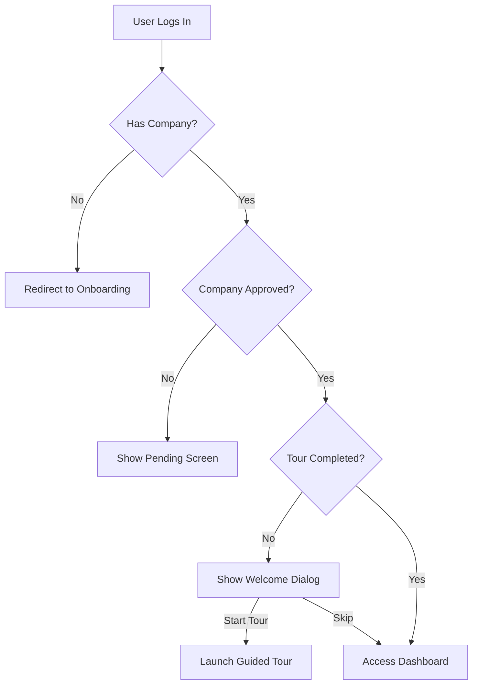

# Phase 4: Onboarding Flow - Implementation Documentation

## Overview
Complete onboarding system with company registration, approval workflow, guided tours, and notification integration.

## Components Implemented

### 1. Onboarding Status Hook (`useOnboardingStatus.ts`)
**Purpose**: Track user's onboarding progress across the application

**Features**:
- Company association check
- Company approval status
- Tour completion tracking
- Real-time status updates

**Usage**:
```typescript
const { hasCompany, companyApproved, tourCompleted, loading } = useOnboardingStatus();
```

### 2. Onboarding Gate (`OnboardingGate.tsx`)
**Purpose**: Control access to the application based on onboarding status

**Flow**:
1. Check if user has a company → redirect to `/onboarding` if not
2. Check company approval status → show pending screen if not approved
3. Allow access to application once approved

**Pending Approval Screen**:
- Professional waiting message
- Timeline expectations (24-48 hours)
- Support contact information
- Visual feedback with animated icons

### 3. Welcome Dialog (`WelcomeDialog.tsx`)
**Purpose**: Greet newly approved users and introduce the guided tour

**Triggers**:
- User logs in for the first time after approval
- Company is approved
- Tour hasn't been completed yet

**Features**:
- Animated welcome with sparkles effect
- Feature highlights:
  - Quick Start (2-minute tour)
  - Role-based guidance
  - Key platform features
- Options to start tour or skip

**User Flow**:


### 4. Guided Tour Integration
**Previous State**: Commented out in Dashboard
**Current State**: Fully integrated with conditional rendering

**Implementation**:
- Tour launches on user action (from Welcome Dialog)
- Role-specific tour steps
- Tracks completion in profiles table
- Prevents repeated tours

**Code Integration**:
```tsx
const [startTour, setStartTour] = useState(false);

<WelcomeDialog onStartTour={() => setStartTour(true)} />
{startTour && <GuidedTour role={userRole} />}
```

### 5. Notification Center Integration
**Location**: Fixed position in AppLayout (top-right corner)
**Features**:
- Real-time notifications via Supabase Realtime
- Onboarding-related notifications
- Company approval notifications
- System updates

**Positioning**:
```tsx
<div className="fixed top-4 right-4 z-50 flex items-center gap-2">
  <NotificationCenter />
  <ThemeToggle />
</div>
```

## Complete User Journey

### New User Registration
1. **Sign Up** → `/auth`
   - Create account with email/password
   - Email verification (if enabled)

2. **Company Onboarding** → `/onboarding`
   - 6-step wizard:
     - Company Type (Media Owner/Agency)
     - Basic Details (Name, Legal Name)
     - Tax Information (GSTIN, PAN)
     - Address (Full location details)
     - Contact (Phone, Email, Website)
     - Review & Submit
   - Creates company record with `status: 'pending'`
   - Links user as company admin

3. **Pending Approval** → Custom Screen
   - Professional waiting interface
   - Timeline expectations
   - Support contact info
   - User cannot access main application yet

4. **Admin Approval** → `/admin/companies`
   - Platform admin reviews company
   - Updates status to `active`
   - System sends approval notification

5. **First Login After Approval** → `/admin/dashboard`
   - Welcome Dialog appears automatically
   - User chooses to start tour or skip
   - If started: Role-based guided tour launches
   - Tour completion tracked in database

6. **Subsequent Logins**
   - Direct access to dashboard
   - No welcome dialog or tour
   - Full application access

## Database Requirements

### Existing Tables Used
- `companies`: Store company information and status
- `company_users`: Link users to companies with roles
- `profiles`: Track tour completion
- `notifications`: Store onboarding notifications

### Tour Completion Tracking
```sql
-- profiles table should have:
tour_completed BOOLEAN DEFAULT FALSE
```

## Configuration

### localStorage Keys
- `welcome-seen-{userId}`: Tracks if user has seen welcome dialog
- Prevents dialog from showing multiple times

### Notification Categories
- `onboarding`: Company registration, approval updates
- `system`: Platform updates, maintenance
- `campaign`: Campaign-related updates

## Security Considerations

### OnboardingGate Protection
- Prevents unauthorized access to application
- Enforces company approval before access
- Server-side validation via RLS policies

### RLS Policies Required
```sql
-- Company approval check
CREATE POLICY "Users can only access if company approved"
ON companies FOR SELECT
USING (
  status = 'active' AND
  id IN (
    SELECT company_id FROM company_users
    WHERE user_id = auth.uid()
  )
);
```

## Testing Checklist

- [ ] New user can complete onboarding wizard
- [ ] Pending approval screen shows correctly
- [ ] User cannot bypass pending approval
- [ ] Welcome dialog appears after first approval
- [ ] Guided tour launches correctly
- [ ] Tour completion is tracked
- [ ] Welcome dialog doesn't re-appear
- [ ] Notifications appear in real-time
- [ ] Role-based tour steps are correct
- [ ] Multiple companies can be managed

## Future Enhancements

1. **Email Notifications**
   - Send email on company approval
   - Reminder emails for pending registrations

2. **Onboarding Analytics**
   - Track completion rates
   - Identify drop-off points
   - Time to complete onboarding

3. **Progressive Disclosure**
   - Multi-phase onboarding
   - Feature discovery over time
   - Achievement system

4. **Video Tutorials**
   - Embedded tutorial videos
   - Role-specific training content
   - Interactive demos

5. **Onboarding Customization**
   - Company-specific onboarding
   - Industry-specific flows
   - Localization support

## Integration Points

### With Other Phases
- **Phase 1**: Navigation and routing
- **Phase 2**: Workflow completion after onboarding
- **Phase 3**: Company-specific settings
- **Phase 7**: AI assistant for onboarding help

## Support & Documentation

- Support email: support@go-ads.com
- Expected approval time: 24-48 hours
- Business hours: Monday-Friday, 9 AM - 6 PM IST

## Conclusion

Phase 4 provides a complete, professional onboarding experience that:
- Guides users through company setup
- Enforces approval workflow for security
- Welcomes approved users warmly
- Introduces platform features contextually
- Provides real-time notifications
- Tracks progress and completion
